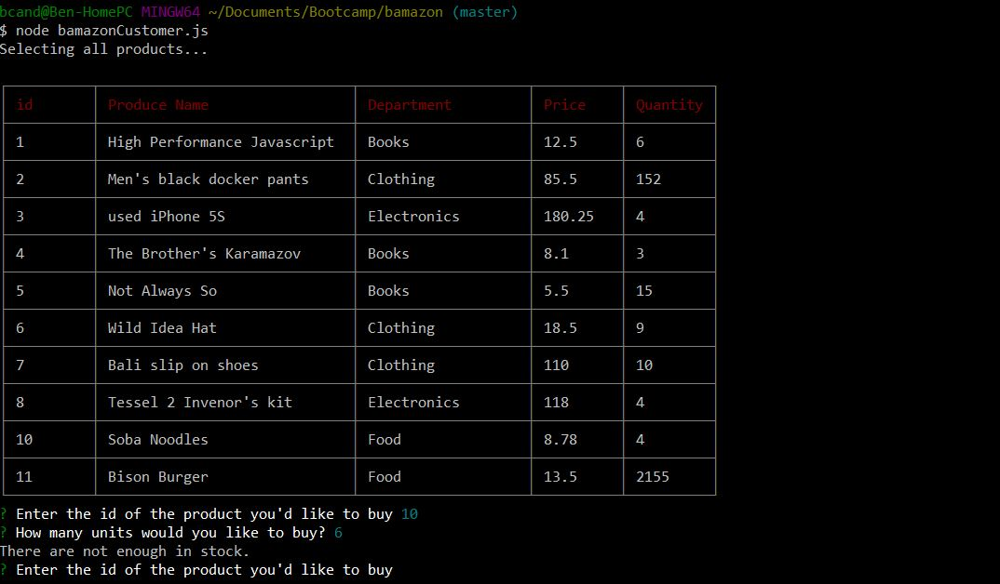
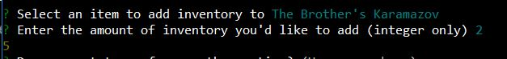

# Bamazon
A Command Line Store Front and Order Management System


Bamazon is a 3 part command line program composed over a Customer, Manager, and Supervisor programs to interact with the Bamazon Store Front.
Bamazon customers can view items and inventory and submit orders.  Bamazon Managers can view all products for sale, view items with low inventory,
 add inventory to a product, and add a new product to the store.  Bamazon Supervisors can view the 

### Bamazon Customer

Step 1) Launch the app by navigating to the direcotory and running the bamazon customer app
```
node bamazonCustomer.js

```

This first prints out a view of all items for sale, along with avaialble inventory and other information.  The customer is asked to select the item the want to purchase
by id and enter the quantity to purchase.


Once they've entered and submitted an order, and updated inventory view is presented along with a summary and cost of the order.


If insufficient quantity exists, the order is blocked from completing, the customer is informed and returned to the order placement function.


### Bamazon Manager

Step 1) Launch the app by navigating to the direcotory and running the bamazon manager app
```
node bamazonManager.js

```

This first screen lists all the options a manager may take.  Use the arrow keys and enter to select and action.


Selecting View Products For Sale shows all avaialble products, after each action completes the manager is sent to the 'Continue' function, which asks if they
want to perform another action.  If they select 'Y', the original options screen is brought up, otherwise the program exits


Selecting View Low Inventory shows all items with inventory less than 5


Selecting Add to Inventory brings up a list of each product name, the manager can select a product from here


After a product is select, a quantity to add is asked for, and specified as integers only.  The new total is returned.


Adding an new product walks the manager through all the input fields needed and confirms the item has been added.


The McRib can now be seen on the items list


### Bamazon Supervisor

Step 1) Launch the app by navigating to the direcotory and running the bamazon supervisor app
```
node bamazonSupervisor.js

```

2 options are available for supervisors.


View Product Sales by Department shows the total sales and profit by department


If insufficient quantity exists, the order is blocked from completing, the customer is informed and returned to the order placement function.

